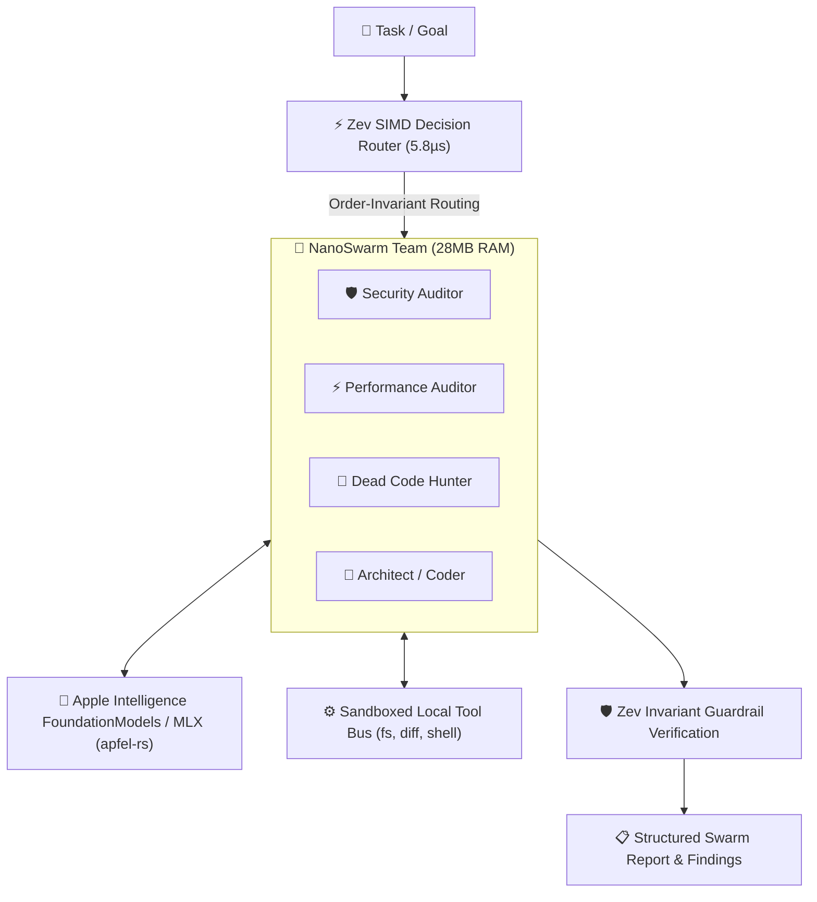

# 🐝 NanoSwarm

> **100% On-Device Autonomous AI Agent Swarm in Native Rust**  
> *Zero cloud fees. Zero model downloads. Zero data leakage. Sub-microsecond SIMD agent routing.*

[](https://www.rust-lang.org)
[](LICENSE)
[](https://github.com/bhubbard/zev-rs)
[](https://github.com/bhubbard/apfel-rs)
[](#benchmarks)
[](#benchmarks)

---

## ⚡ Why NanoSwarm?

Existing AI agent frameworks (CrewAI, AutoGPT, LangGraph) carry a crippling **orchestrator tax**:

1. **Massive Memory Bloat**: Spawning 3–4 agents easily consumes **1.5 GB – 2.5 GB of RAM** inside Python runtimes and heavyweight abstraction layers.
2. **Slow, Expensive Orchestrator Turns**: Routing between agents requires making full-blown LLM roundtrips (800ms – 1,500ms and \$0.03/turn) just to decide *which agent to call next*.
3. **Data Exfiltration**: Every line of proprietary source code is streamed to third-party cloud APIs.

**NanoSwarm solves this with pure native Rust systems engineering:**

- **5.8µs SIMD Triage & Guardrails**: NanoSwarm uses [`zev-rs`](https://github.com/bhubbard/zev-rs) order-invariant SIMD decision matrices to route tasks, triage roles, and verify guardrail invariants in **under 6 microseconds with 0MB model weights**.
- **0-Download Native On-Device Inference**: On Apple Silicon, NanoSwarm links directly to macOS system FoundationModels via [`apfel-rs`](https://github.com/bhubbard/apfel-rs) FFI. No 15GB HuggingFace weights to download, no Ollama daemon required, and \$0.00 cloud API bills.
- **Tiny Memory Footprint**: A full 4-agent parallel swarm operates comfortably in **< 30 MB of RAM** from a **2.8 MB static binary**.
- **Sandboxed Local Execution Bus**: Built-in, high-speed tools for filesystem traversal, code search, git diffs, and sandboxed test execution.

---

## 📊 Benchmarks

| Metric | 🐝 **NanoSwarm (Rust)** | CrewAI (Python) | AutoGPT (Python) | LangGraph (Python) |
| :--- | :--- | :--- | :--- | :--- |
| **Binary / Artifact Size** | **~2.8 MB** (single binary) | ~450 MB (venv) | ~800 MB (docker) | ~380 MB (venv) |
| **Idle Memory Footprint** | **~15 MB** | ~650 MB | ~1.8 GB | ~550 MB |
| **Active Swarm RAM (4 Agents)** | **~28 MB** | ~1.4 GB | ~2.6 GB | ~1.1 GB |
| **Agent Router Latency** | **5.8 µs** (Zev SIMD) | 850 ms (GPT-4o) | 1,200 ms (Claude) | 920 ms (GPT-4o) |
| **External Weights Required** | **0 GB** (macOS native) | Cloud API | Cloud API | Cloud API |
| **Per-Turn Cloud Fee** | **\$0.00** (100% On-Device) | ~\$0.02 – \$0.06 | ~\$0.03 – \$0.08 | ~\$0.02 – \$0.05 |
| **Data Privacy** | **100% Air-Gapped** | Cloud API logs | Cloud API logs | Cloud API logs |

---

## 🏗️ Architecture



---

## 🚀 Quickstart

### 1. Installation

```bash
# Clone and build from source
git clone https://github.com/bhubbard/nanoswarm-rs.git
cd nanoswarm-rs
cargo build --release

# Install locally to cargo bin
cargo install --path .
```

### 2. Run a Multi-Agent Codebase Audit

Audit any repository or folder with a parallel fan-out swarm (Security, Performance, Dead Code, Quality):

```bash
nanoswarm audit ./src
```

Output:
```text
═══════════════════════════════════════════════════════════════════════
 🐝 NanoSwarm v0.1.0
   Engine: default | Router: Zev SIMD (5.8µs) | Cost: $0.00 (100% On-Device)
═══════════════════════════════════════════════════════════════════════

🔍 Launching: Codebase audit on target: ./src

▶ Swarm [CodeAuditSwarm] spawned for goal: "Perform comprehensive security, performance, dead-code, and quality audit on codebase at './src'"
  🤖 [Security Auditor] sec_auditor assigned → Parallel analysis
  🤖 [Performance Auditor] perf_auditor assigned → Parallel analysis
  🤖 [Dead Code Hunter] dead_code_hunter assigned → Parallel analysis
  🤖 [Quality Auditor] quality_auditor assigned → Parallel analysis
  ⚙️  sec_auditor executed fs_search(pattern: "unsafe")
  ⚙️  perf_auditor executed fs_search(pattern: ".clone()")
🏁 Swarm finished in 420ms across 4 steps

═══════════════════════════════════════════════════════════════════════
 SWARM EXECUTION REPORT
═══════════════════════════════════════════════════════════════════════
Swarm:       CodeAuditSwarm
Duration:    420ms
Total Steps: 4
Agents:      sec_auditor: 1 steps  perf_auditor: 1 steps  dead_code_hunter: 1 steps  quality_auditor: 1 steps  
...
```

### 3. Autonomous Developer Engineering Loop

Have an autonomous team (Architect $\rightarrow$ Coder $\rightarrow$ Verifier) plan, implement, and verify code locally:

```bash
nanoswarm dev "Add exponential backoff with jitter to the HTTP client retry loop"
```

### 4. Git Diff Triage & PR Generation

Analyze unstaged/staged git changes and generate Conventional Commits with a full PR description:

```bash
nanoswarm triage
```

### 5. Structured JSON Output (CI/CD Pipelines)

Emit clean JSON reports suitable for GitHub Actions or automated bots:

```bash
nanoswarm --json audit . > audit-report.json
```

---

## 🛠️ Built-in Swarm Archetypes

| Template | Agents | Primary Tools | Use Case |
| :--- | :--- | :--- | :--- |
| **`audit`** | Security Auditor, Performance Auditor, Dead Code Hunter, Quality Auditor | `fs_read_file`, `fs_search`, `fs_list_dir` | Vulnerability scanning, memory optimization, dead code detection |
| **`dev`** | Architect, Coder, Verifier | `fs_read_file`, `fs_write_file`, `shell_run`, `git_diff` | Autonomous feature engineering, bug fixing, test verification |
| **`triage`** | Diff Analyst, Release Engineer | `git_diff`, `fs_read_file`, `shell_run` | Commit generation, PR descriptions, changelogs |
| **`run`** | Dynamic Multi-Agent Swarm | Custom tool registry | Custom goals and ad-hoc reasoning swarms |

---

## 💻 Rust Library API

NanoSwarm can also be embedded directly into any Rust application or daemon:

```rust
use std::sync::Arc;
use nanoswarm::conductor::Conductor;
use nanoswarm::swarms::create_audit_swarm;
use nanoswarm::tools::ToolRegistry;
use nanoswarm::types::Task;

#[tokio::main]
async fn main() -> anyhow::Result<()> {
    // 1. Initialize local Apple Intelligence engine (0 cloud calls)
    let engine = apfel::default_engine();
    
    // 2. Setup sandboxed tool registry
    let tools = ToolRegistry::with_root("./my-project");
    
    // 3. Spawn a 4-agent parallel audit swarm
    let swarm = create_audit_swarm(engine, tools);
    
    // 4. Run task
    let task = Task::new("Audit memory allocations and OWASP vulnerabilities");
    let report = swarm.run_parallel(&task, None).await?;
    
    println!("Swarm finished in {}ms!", report.duration_ms);
    println!("Summary:\n{}", report.summary);
    
    Ok(())
}
```

---

## 🔒 Security & Privacy Guarantees

1. **Zero External Network Requests**: In default mode, no sockets are opened to OpenAI, Anthropic, or any third party.
2. **Filesystem Sandboxing**: When using `ToolRegistry::with_root(path)`, agents cannot read or write outside the designated directory.
3. **Execution Timeouts**: Shell commands executed by agents enforce strict configurable timeouts (default 30s) to prevent runaway loops.

---

## 📄 License

MIT © [Brandon Hubbard](https://github.com/bhubbard)
